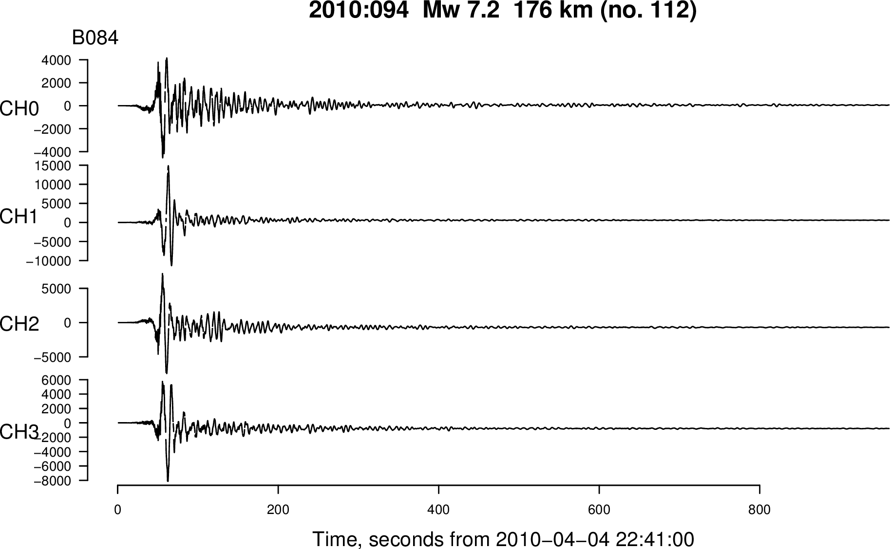

# pbe-data

This is the full dataset of 
[Plate Boundary Observatory](http://www.unavco.org/projects/major-projects/pbo/pbo.html)
 borehole strain timeseries from Barbour and Crowell (2016) "Dynamic Strains for Earthquake Source Characterization".

For each earthquake-station pair the data are in [R](https://www.r-project.org/)'s
[binary format](https://stat.ethz.ch/R-manual/R-devel/library/base/html/save.html), with one
file (`'bsmdata.rda'`) representing the timeseries of linear gauge strain ( in 10<sup>-9 </sup>), and another 
file (`'bsmdata_nfo.rda'`) representing metadata associated with the timeseries. We also include a
pdf figure of the timeseries in (`'fig_timeseries.pdf'`) for reference. Here, for example, is the timeseries at B084 for the
2010 M<sub>W</sub> 7.2 El Mayor Cucapah earthquake
showing peak strains of nearly 15 &#215; 10<sup>-6</sup> (microstrain).



We have included a sample R script [`plot_bsmdata.R`](plot_bsmdata.R) to show how 
a similar version of this figure can be reproduced.

## How to get this data

Download the full archive here: https://github.com/abarbour/pbe-data/archive/master.zip

Or use version control (git, Subversion, etc.):

	git clone git@github.com:abarbour/pbe-data.git

The total size of this repository is on the order of 800 Mb, so the first 
fetch will take a considerable amount of time. The size can be minimized slightly 
by replacing `git clone` with `git clone --depth 1` in the expression above.


## Metadata included

### [`bsm_station_times.txt`](bsm_station_times.txt)
	
This file lists the earthquake-station pairs by four-character station ID, origin time,
and hypocentral distance in kilometers:

```c
sta4 year mo dy hr mi sec geodkm
B001 2004 1 25 15 12 29 367.79
B003 2004 1 25 15 12 29 296.98
B004 2004 1 25 15 12 29 271.42
B005 2004 1 25 15 12 29 341.16
B006 2004 1 25 15 12 29 341.36
```

and so on.

[`earthquakes.txt`](earthquakes.txt)

This file gives information regarding the earthquake origin time, location, and magnitude.

```c
eqnum	year	mo	dy	hr	mi	sec		nlat	elon	depkm	Mw
    1	2004	1	25	15	12	28.6	49.05	-127.88	12.0	5.4
	2	2004	3	17	23	53	13.9	36.03	-121.35	12.0	4.7
	3	2004	6	15	22	28	52.4	32.45	-117.92	12.0	5.0
	4	2004	7	12	16	45	3.7		44.30	-124.71	20.0	4.9
	5	2004	7	15	12	6	54.0	49.48	-127.17	18.7	5.7
```

and so on.

[`Earthquake_BSM_pairs.txt`](Earthquake_BSM_pairs.txt)

This file is effectively a merge of `earthquakes.txt` and `bsm_station_times.txt`, except with
the addition of an earthquake identifier, the sixteen-character station ID, and the Julian day of
the origin time. The earthquake identifier is defined as `[year].[jday]_[Mw]`.

```c
year mo dy hr mi sec sta4 sta16            geodkm jday eqnum nlat  elon    depkm Mw  eqid        
2004  1 25 15 12 29  B001 golbeck01bwa2005 367.79 025    1   49.05 -127.88 12.0  5.4 2004.025_5.4
2004  7 12 16 45  4  B001 golbeck01bwa2005 433.24 194    4   44.30 -124.71 20.0  4.9 2004.194_4.9
2004  7 15 12  6 54  B001 golbeck01bwa2005 337.13 197    5   49.48 -127.17 18.7  5.7 2004.197_5.7
2004  7 19  8  1 52  B001 golbeck01bwa2005 344.81 201    6   49.60 -127.19 24.8  6.3 2004.201_6.3
2004 11  2 10  2 16  B001 golbeck01bwa2005 459.27 307   14   49.17 -129.13 19.0  6.6 2004.307_6.6
```

and so on.

## Utility scripts
	
[listFiles](listFiles) is a bash shell script that can be used to list
files by the earthquake and station identifiers. This includes both
the raw data and metadata files:


```c
$ listFiles | head -5
eqid         sta4 type rdafile
2005.323_5.3 B001 raw  2005/2005.323_5.3/B001/bsmdata.rda
2005.323_5.3 B004 raw  2005/2005.323_5.3/B004/bsmdata.rda
2005.323_5.3 B005 raw  2005/2005.323_5.3/B005/bsmdata.rda
2005.323_5.3 B006 raw  2005/2005.323_5.3/B006/bsmdata.rda
```

```c
$ listFiles | tail -5
2014.072_5.5 B040 nfo  2014/2014.072_5.5/B040/bsmdata_nfo.rda
2014.072_5.5 B045 nfo  2014/2014.072_5.5/B045/bsmdata_nfo.rda
2014.072_5.5 B933 nfo  2014/2014.072_5.5/B933/bsmdata_nfo.rda
2014.072_5.5 B934 nfo  2014/2014.072_5.5/B934/bsmdata_nfo.rda
2014.072_5.5 B935 nfo  2014/2014.072_5.5/B935/bsmdata_nfo.rda
```
